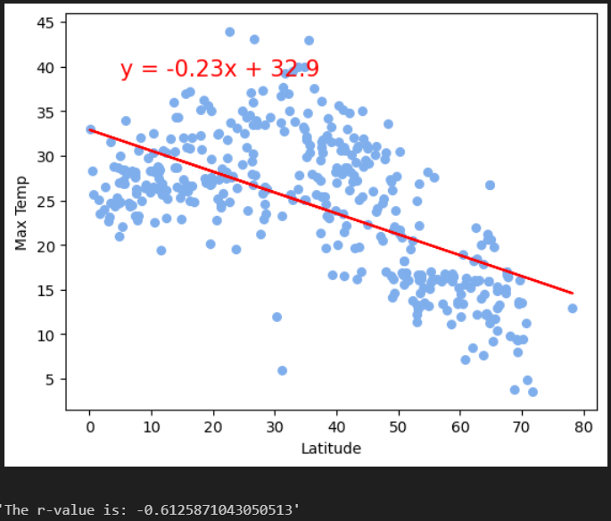
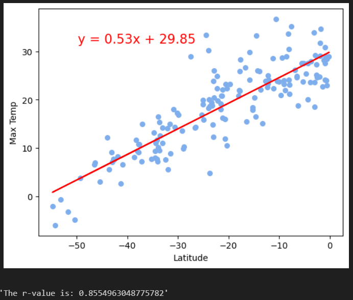
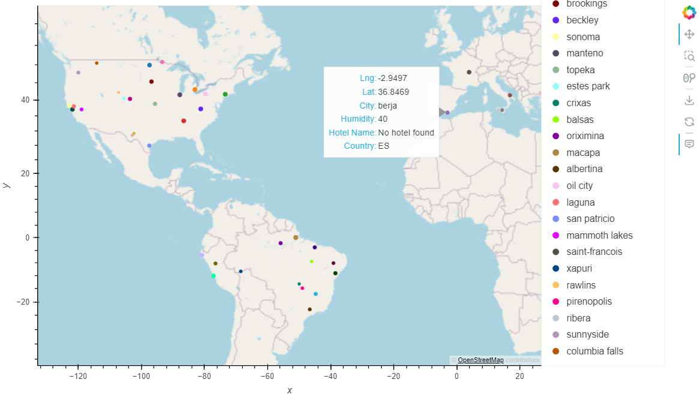

# Weather Analysis using OpenWeather, citypy, and Geoapify
This project analysis weather leveraging multiple APIs in two ways:
* WeatherPy: visualize the weather of over 500 cities of varying distances from the equator
* VacationPy: identify locations globally that meet desired parameters for vacationing

# Features
* WeatherPy
   * Create a random list of cities from random latitude and longitude numbers using citypy
   * Use the OpenWeather API to gather the following weather data for each city: maximum temperature, humidity, cloudiness, wind speed, country, and date of reading
   * Compute Linear Regression for the following relationships for each hemisphere separately:
      * Temperature vs. Latitude
      * Humidity vs. Latitude
      * Cloudiness vs. Latitude
      * Wind Speed vs. Latitude
   * Describe any relationships that you notice and any other findings you may uncover.
* VacationPy
   * Create a map of all cities in which the dot size is related to humidity
   * Reduce the city list to ideal conditions
   * Use the Geoapify API to find the first hotel located within 10 km of the city coordinates for ideal cities
   * Create a map of the ideal cities that has a pop-up with coordinates, city name, humidity, hotel name, and country 

# Results
The only notable relationship between weather and latitude is maximum temperature as shown below. 

Northern Hemisphere | Southern Hemisphere
:-------------------------:|:-------------------------:
On 7/24/2023, the northern hemisphere temperature had a -0.613 correlation with latitude | On 7/24/2023, the southern hemisphere temperature had a 0.85 correlation with latitude 
  |  

Top Vacation City Requirements: maximum temperature between 21.1C and 37.8C, humidity less than 60%, wind speed less than 10, and within one of the following countries - AU, BR, FR, DE, HU, IE, IT, NZ, PE, PT, ZA, ES, CH, GB, US
Top Vacation Cities:  

# File Notes
* WeatherPy folder contains the jupyter notebook and output data files created per the Instructions below.
   * WeatherPy.py is the jupyter notebook file that pulls random latitude and longitude combinations to identify cities across the world capturing max temperature, humidity, cloudiness, wind speed, country, and date of data collection. The data is analyzed for trends of latitude vs. max temperature, humidity, cloudiness, and wind speed.
   * VacationPy.py is the jupyter notebook file that takes the city list from WeatherPy and plots each one. Then I reduce the list by my desired parameters and search for nearby hotels. I plot the subset with hotel information added
   * output_data folder contains the output from WeatherPy as follows:
      * Fig1.png is the scatter plot of latitude vs. max temperature (C) across all cities.
      * Fig2.png is the scatter plot of latitude vs. humidity (%) across all cities.
      * Fig3.png is the scatter plot of latitude vs. cloudiness (%) across all cities.
      * Fig4.png is the scatter plot of latitude vs. wind speed (m/s) across all cities.
      * cities.csv contains the dataframe with all the cities located near the random longitude, latitude coordinates including city ID, city, latitude, longitude, max temperature (C), humidity (%), cloudiness (%), wind speed (m/s), country abbreviation, and datecode for data collection time.
* Start_Code folder contains the files provided in BCS/Canvas for completing the challenge.

    

# References
The following references were used in creating the solution within the PyCitySchools folder:
 * Starter_Code\starter_code\WeatherPy.ipynb leveraged for file dependencies, setup, and some code execution as well as guiding output visuals
 * Starter_Code\starter_code\VacationPy.ipynb leveraged for file dependencies, setup, and some code execution as well as guiding output visuals
 

# Getting Started

## Prerequisites
You must have and environment with python 3.10+, jupyter notebook,  matplotlib, scipy, requests, and citipy installed.

Additionally, you must create a python file with API keys as follows:
* file name: api_keys.py
* defined api keys as follows:
   * weather_key = "your_key_here" created by following instructions provided by OpenWeather: https://openweathermap.org/api 
   * geoapify_key = "your_key_here" created by following instructions provided by Geoapify: https://apidocs.geoapify.com/ 

## Cloning Repo
$ git clone https://github.com/vt-bekah/python-api-challenge.git

$ cd python-api-challenge

$ jupyter lab

# Built With
* Python v3.10.11
* jupyter notebook v6.5.2
* jupyterlab v3.6.3
* conda v23.5.0
* matplotlib v3.7.1
* scipy v1.10.1
* requests v.2.29.0
* citipy 0.0.6

**Python Modules**
* pandas v1.5.3
* numpy v1.24.3
* time v1.24.3